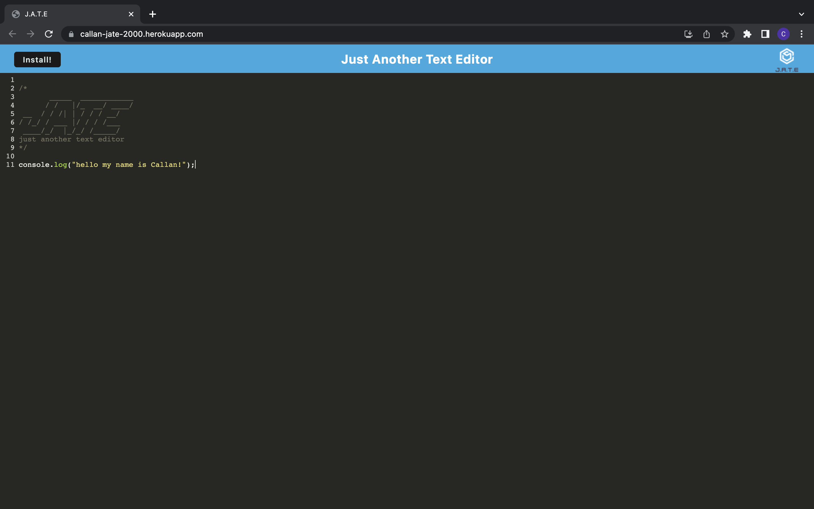

# text-editor

# Deployed Heroku app

### https://callan-jate-2000.herokuapp.com/

# Description

### This project is an offline text editor that meets PWA criteria and allows a user to create notes or code snippets offline, allowing users to retrieve them for later use.

# Table of contents

- [Installation](#installation)
- [Usage](#usage)
- [Languages Used](#languages-used)
- [Credits](#credits)
- [Questions](#questions)

# Installation

### npm install is required for this project

# Usage

### Code Snippet:

### 

# Languages Used

- Javascript

- Node.js

- Express.js

- PWA

- Webpack

# Credits

### Callan Hunter

### LinkedIn: https://www.linkedin.com/in/callan-hunter-195816196/

### GitHub: https://github.com/callanhunter

# Questions

### You can reach me at @callan57hunter@gmail.com
